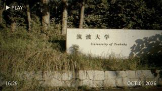
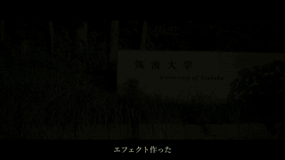
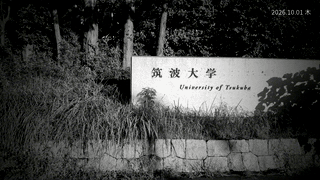
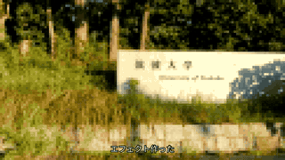
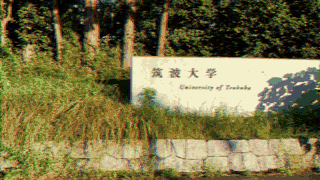
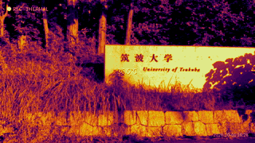
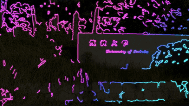

# setlog-formats

[setlog-remix](https://github.com/horiyu/setlog-remix) 用のフォーマット集。iPhone のショートカットで撮った動画を、
ここにあるフォーマット（エフェクトと編集の型）で仕上げてから [setlog](https://setlog.kr/) に送る。

ショートカットにこのリポジトリ（`horiyu/setlog-formats`）を書いておくと、撮ったあとにフォーマットの一覧が出る。
自分のフォーマットを作るなら、このリポジトリを fork するか、同じ構成のリポジトリを作って、ショートカットの
リポジトリ名を書き換えるだけでよい。

*Formats for setlog-remix: point the iOS Shortcut at a repository like this one and pick a format after
shooting. A format is a JSON file — no code runs — so anyone can publish one.*

| id | 名前 | 内容 | 見た目 |
|---|---|---|---|
| `plain` | そのまま | 最初の3秒を枠いっぱいに | — |
| `vhs` | VHS | 色あせ・にじみ・走査線・ノイズ、`▶ PLAY` と日付時刻 |  |
| `film` | シネマ | ティール＆オレンジの LUT、シネスコの黒帯、一言を字幕に |  |
| `mono` | モノクロ | 硬めの白黒と粒子、日付と曜日 |  |
| `timelapse` | タイムラプス | 撮影した全体を 2.5 秒に早送りし、倍率を表示 |  |
| `boomerang` | ブーメラン | 最初の 1.3 秒を往復する |  |
| `pixel` | ドット | 粗いドット絵にして、一言を下に表示 |  |
| `snow` | 雪 | 大粒の雪が吹きつける。手前の雪はぼけて速く動き、奥の雪は物の後ろに回り込む |  |
| `sakura` | 花吹雪 | 桜吹雪が風にあおられて画面いっぱいに舞う |  |
| `bubbles` | シャボン玉 | 大小の虹色シャボン玉が次々に湧き上がる |  |
| `confetti` | 紙吹雪 | 四隅と中央から紙吹雪が何度も打ち上がり、きらきらと降ってくる |  |
| `note` | 置き手紙 | 一言を札にして、その場に置く。カメラが動いても同じ場所に留まり、人が前を通ると隠れる |  |
| `speech` | 吹き出し | 写っている人の頭の上に、一言の吹き出しがついていく |  |
| `aura` | オーラ | 人の輪郭がゆらめく光をまとう |  |
| `elsewhere` | 異世界 | 人だけを残して、背景を宇宙・水中・絵画のいずれかに差し替える（投稿ごとにランダム） |  |
| `afterimage` | 残像 | 動いたものが色を変えながら尾を引く |  |
| `glitch` | グリッチ | ときどき画面がずれたり裂けたりする |  |
| `thermal` | サーマル | サーモカメラ風の色と計測表示 |  |
| `neon` | ネオン | 景色が暗く沈み、輪郭だけが色を変えながら光る |  |

雪から残像まで、およびグリッチ・ネオンは、映像の内容を解析して処理するエフェクト（下の「AR のエフェクト」）を使う。
setlog-remix 側で `bin/setup-ar.sh` を実行済みであること。GPU は不要で、一般的なノート PC の CPU でも 3 秒の動画を 30 秒ほどで仕上げられる。

## フォーマットの作り方

`formats/<id>/format.json` を1つ置くと1つのフォーマットになる。`<id>` は英数字とハイフン。

```json
{
  "spec": 1,
  "name": "VHS",
  "description": "90年代のホームビデオ。日付入り",
  "order": 10,
  "clip": { "mode": "head", "duration": 3 },
  "frame": { "mode": "fill" },
  "effects": [
    { "type": "grade", "contrast": 1.12, "saturation": 0.78, "temperature": 0.35 },
    { "type": "scanlines", "spacing": 3, "opacity": 0.22 },
    { "type": "text", "text": "{date:%b. %d %Y}", "uppercase": true, "position": "bottom-right" }
  ]
}
```

仕上がりは **1710×962・30fps・音なし**（setlog が撮影する横長の枠）。setlog の Log に残るのは頭から **2 秒強**
なので、見せたいものは最初の 2 秒に置く。数値が範囲外ならエラーになる。未知のキーもエラーになる（打ち間違いに気づけるようにするため）。

### いちばん上

| キー | 既定 | |
|---|---|---|
| `spec` | 1 | 書式の版。今は 1 |
| `name` | id | 一覧に出る名前（40字まで） |
| `description` | "" | 一覧で名前の横に出る説明（120字まで） |
| `order` | 100 | 一覧の並び順（小さいほど上） |
| `author` | "" | 作者 |
| `post_caption` | true | false にすると、setlog に一言を送らない（一言を映像の中に描くフォーマット用。吹き出しなどで同じ言葉が二重に出るのを防ぐ） |
| `clip` | | どこを使うか（下） |
| `frame` | | 枠への収め方（下） |
| `effects` | [] | 上から順にかかるエフェクト（24個まで） |

### clip

| キー | 既定 | 範囲 | |
|---|---|---|---|
| `mode` | `head` | `head` / `middle` / `tail` / `fit` | 先頭から / 中央 / 末尾 / 全体を `duration` に収まるよう早送り |
| `start` | 0 | 0–3600 | `head` は頭から何秒読み飛ばすか、`tail` は終わりの何秒手前で終えるか |
| `duration` | 3 | 0.5–15 | 出来上がりの秒数 |
| `speed` | 1 | 0.25–8 | 再生速度（`fit` では自動） |
| `loop` | `none` | `none` / `reverse` / `boomerang` | 逆再生 / 往復（前半 `duration/2` を往復再生） |

### frame

| キー | 既定 | |
|---|---|---|
| `mode` | `fill` | `fill` は切り取って枠いっぱいに表示し、`fit` は全体を収めて余白をぼかしで埋める |
| `turn` | `none` | 縦長の動画を `ccw`（反時計回り）/ `cw`（時計回り）に回転して横向きにしてから収める |
| `background` | `#0E0E10` | 予備の背景色 |

### effects

各エフェクトは `{"type": "<種類>", ...}`。色は `#RRGGBB`・`#RRGGBBAA`・`white` `black` `red` `yellow` `green` `blue` `orange` `gray`。

| type | パラメータ（既定） |
|---|---|
| `grade` | `brightness` 0（-1–1）、`contrast` 1（0–3）、`saturation` 1（0–3）、`gamma` 1（0.1–5）、`hue` 0（-180–180 度）、`temperature` 0（-1 寒色 – 1 暖色） |
| `mono` | なし。白黒 |
| `sepia` | `amount` 1（0–1） |
| `invert` | なし。ネガ |
| `mirror` | なし。左右反転 |
| `grain` | `amount` 20（0–100）。ノイズ |
| `vignette` | `strength` 0.5（0–1）。周辺減光 |
| `blur` | `radius` 4（0–60） |
| `sharpen` | `amount` 1（0–3） |
| `pixelate` | `size` 16（2–200）。1 ドットあたりの画素数 |
| `rgbshift` | `amount` 6（0–60）。赤と青をずらして色収差を出す |
| `scanlines` | `spacing` 4（2–40）、`opacity` 0.3（0–1） |
| `letterbox` | `ratio` 2.39（1.78–4）、`color` black。上下の黒帯を付ける |
| `fade` | `in` 0、`out` 0（秒、0–5）、`color` `black` / `white` |
| `zoom` | `from` 1、`to` 1.15（1–3）。ゆっくり寄る |
| `lut` | `file`（必須）。`.cube` の 3D LUT |
| `text` | 下の表 |
| `image` | `file`（必須、PNG / JPEG）、`position` center、`margin` 0、`width` 1710（px）、`opacity` 1、`from` / `until`（秒） |
| `thermal` | `palette` inferno（`inferno` `magma` `plasma` `turbo` `heat` `fiery` `cool`）、`contrast` 1.3（0.5–3）、`blur` 2（0–10）。サーモカメラ風の色 |

`text`:

| キー | 既定 | |
|---|---|---|
| `text` | （必須） | 200字まで。改行は `\n`。下の変数が使える |
| `font` | `sans` | `sans` / `sans-bold` / `serif` / `mono`（PC のフォント）か、リポジトリ内の `.ttf` `.otf` `.ttc` |
| `size` | 48 | 文字の大きさ（px、8–400） |
| `color` | white | |
| `position` | `bottom-right` | `top-left` `top` `top-right` `left` `center` `right` `bottom-left` `bottom` `bottom-right` |
| `margin` | 48 | 枠の端からの距離（px） |
| `uppercase` | false | 大文字にする |
| `box` / `box_color` | false / `#00000080` | 文字の後ろに帯 |
| `shadow` / `shadow_color` | 0 / `#000000B0` | 影のずれ（px） |
| `border` / `border_color` | 0 / black | 縁取りの太さ（px） |
| `from` / `until` | 0 / 0 | 表示する時間（秒）。0 は最初から / 最後まで |

### AR のエフェクト

映像の中身（人の形・奥行き・カメラの動き）を解析して処理する。小さなモデルを CPU で実行する（人物の切り抜きに MODNet、奥行き推定に
Depth Anything V2 Small）。人が写っていないときは、人の代わりに一番手前にあるものを使う。大きさ・長さは、枠（1710×962）の高さに対する割合で指定する。

| type | パラメータ（既定） |
|---|---|
| `particles` | `kind`（`snow` `petals` `bubbles` `confetti`）、`count`（1–900）、`size`（粒の大きさ、高さに対する割合 0.002–0.1）、`speed`（0–3）、`wind`（横風 -1–1）、`opacity` 0.9、`depth`（奥の粒を物体の後ろに隠す。紙吹雪以外は true）、`seed`。紙吹雪だけ `bursts`（打ち上げの回数と場所 1–4、既定 1）と `glitter`（金銀のきらめく粒の割合 0–1、既定 0.2） |
| `pin` | `text` "{caption}"、`style`（`card` 白い札 / `neon` 光る文字）、`size` 60（px）、`tilt` -4（度）、`auto` true（人と重ならない場所を自動で選ぶ。false なら `x` `y` 0–1 の位置）、`behind_people` true（人が前を通ると隠れる）、`appear` 0.15（秒、ぽんと現れる）、`font`、`uppercase` |
| `speech` | `text` "{caption}"、`size` 52（px）、`appear` 0.15（秒）、`font`、`uppercase`。人の頭の上についてくる吹き出し |
| `aura` | `width` 0.04、`strength` 0.8（0–2）、`cycle` true（色が移り変わる。false なら `color`）、`hue` 0.55、`color` |
| `background` | `files`（必須、画像 1–8 枚のリスト）、`choose`（`random` 投稿ごとに1枚 / `first`）、`subject`（`auto` `person` `near`、何を前に残すか）、`drift` 0.06（背景がゆっくり寄る量） |
| `glitch` | `amount` 0.5（0–1）、`rate` 2（1 秒あたりの乱れの回数）、`seed` |
| `neon` | `thickness` 2（線の太さ 1–6）、`glow` 0.8（0–2）、`dim` 0.12（元の景色の明るさ 0–1）、`cycle` 0.35（色が流れる速さ、0 なら `color` の単色）、`color` |
| `trail` | `decay` 0.9（尾の残り方 0.5–0.99）、`hue_shift` 0.6（尾の色が回る速さ）、`strength` 0.9 |

変数: `{caption}`（ショートカットで入力した一言）、`{format}`（フォーマット名）、`{speed}`（再生倍率）、
`{date}` `2026.09.28`、`{time}` `21:07`、`{datetime}`、`{year}` `{month}` `{day}` `{hour}` `{minute}` `{second}`、
`{weekday}` `Mon`、`{weekday_ja}` `月`。日時の変数は `{date:%b. %d %Y}` のように strftime の書式も取れる。
日時は動画の撮影時刻（なければ受信した時刻）。

### ファイル

`lut` の `file`、`image` の `file`、`text` の `font` は、その format.json からの相対パス。リポジトリの外は指せない。
共通のファイルは `assets/` に置いて `../../assets/xxx` と書く。1ファイル 20MB まで。
`assets/teal-orange.cube` は `tools/make_cube.py` で作っている。`assets/backgrounds/` の3枚（宇宙・水中・絵画）は画像生成で作ったもの。

### 確かめる

setlog-remix を手元に置いて:

```sh
python3 ../setlog-remix/render.py check formats/*                                       # 書式の確認
python3 ../setlog-remix/render.py render formats/vhs 動画.mov out.mp4 --caption "一言"    # 仕上げてみる
python3 ../setlog-remix/render.py sheet out.mp4 out.png                                  # 4コマに並べる
```

## ライセンス

[MIT License](LICENSE)。作: [horiyu](https://github.com/horiyu)。
